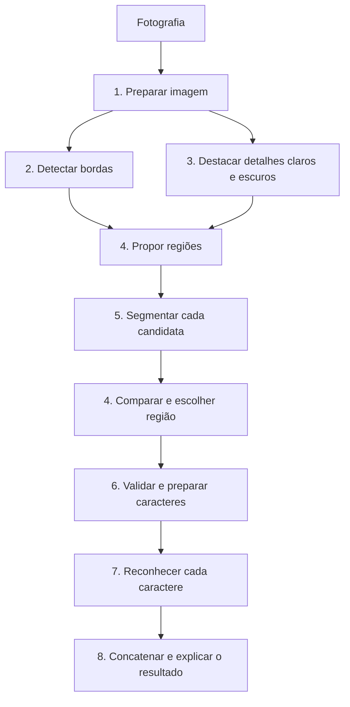

# Como ler o algoritmo

Este roteiro é para quem conhece Python, mas ainda está aprendendo processamento de imagens.
O objetivo é seguir uma fotografia até o texto final e encontrar a responsabilidade de cada módulo.
Não é necessário ler os detalhes matemáticos antes de entender a ordem do programa.

## 1. Comece pelo fluxo, não pela interface

Abra [placas/pipeline.py](../placas/pipeline.py). Há duas operações públicas:

```python
localizacao = localizar(imagem)
resultado = reconhecer(localizacao.segmentacao)
```

`localizar` recebe uma fotografia e devolve a região mais plausível com seus componentes separados.
`reconhecer` recebe essa segmentação, prepara os recortes e devolve um dicionário com o texto,
as listas de caracteres/placas, as tentativas e os avisos. A página pode parar entre as duas funções
para que a pessoa confira os recortes antes de executar o OCR.



As etapas 2 e 3 recebem o mesmo cinza suavizado: a morfologia não recebe o resultado de Canny.
A etapa 4 chama a etapa 5 para cada candidata porque a organização dos componentes ajuda a
escolher a região. Nessa escolha ainda não se sabe se um componente é A, 9 ou qualquer outro símbolo.

## 2. Entenda os dados que circulam

As classes de [modelos.py](../placas/modelos.py) são `dataclass`: agrupam campos, sem executar
processamento. Elas evitam passar muitas variáveis soltas de uma função para outra.

| Nome | Significado |
|---|---|
| `ImagemPreparada` | Foto reduzida, cinza e cinza suavizado, na mesma escala. |
| `Box` / `caixa` | Tupla `(x, y, largura, altura)` descrevendo um retângulo. |
| `Caractere` | Caixa e máscara de um componente; ainda não contém letra reconhecida. |
| `Segmentacao` | Recorte da placa normalizado, máscara, componentes e pontuação geométrica. |
| `CandidataPlaca` | Resumo de uma região avaliada para exibir sua comparação. |
| `Localizacao` | Região escolhida, segmentação e evidências para a página. |
| `EntradaCinza` | Recorte individual em cinza acompanhado da máscara que o originou. |
| `TentativaOCR` | Resposta de uma chamada, com preparo, modo e confiança. |
| `Leitura` | Decisão sobre uma posição, com histórico e motivo; pode continuar `?`. |

Uma imagem é um array NumPy. `imagem.shape` fornece as dimensões; em cinza são `(altura, largura)`.
Em uma imagem colorida há também o eixo dos três canais. No OpenCV a cor usa ordem BGR.
O valor 0 representa preto; 255, branco, quando usamos imagens de oito bits.

```python
x, y, largura, altura = caractere.caixa
recorte = placa[y:y + altura, x:x + largura]
```

Esse trecho seleciona linhas primeiro e colunas depois. O fim do intervalo é exclusivo em Python.
As caixas da localização usam coordenadas da fotografia preparada. As caixas dos caracteres usam
coordenadas da placa redimensionada para largura 600. Misturar essas coordenadas recorta o lugar errado.

## 3. Siga uma responsabilidade de cada vez

| Pergunta | Onde está a resposta |
|---|---|
| Como lemos JPEG, PNG e WebP e tratamos a orientação? | `placas/imagem.py` |
| Como reduzimos ruído e tamanho? | `placas/etapas/e1_preparacao.py` |
| Como procuramos mudanças de intensidade? | `placas/etapas/e2_bordas.py` |
| Como destacamos e agrupamos os traços? | `placas/etapas/e3_morfologia.py` |
| Como as máscaras viram retângulos candidatos? | `placas/localizacao/candidatas.py` |
| Como escolhemos a região? | `placas/etapas/e4_localizacao.py` |
| Qual é a sequência para separar símbolos? | `placas/etapas/e5_segmentacao.py` |
| Como geramos alternativas preto/branco? | `placas/segmentacao/binarizacao.py` |
| Como filtramos objetos pequenos, bordas e formas incompatíveis? | `placas/segmentacao/componentes.py` |
| Como escolhemos uma linha, inclusive inclinada? | `placas/segmentacao/alinhamento.py` |
| Como pontuamos e desempatamos segmentações? | `placas/segmentacao/avaliacao.py` |
| O que impede o OCR antes dos recortes válidos? | `placas/validacao.py` |
| Como montamos as entradas individuais? | `placas/etapas/e6_recortes.py` |
| Como normalizamos, giramos e variamos o mesmo símbolo? | Demais módulos `e6_*` em `placas/etapas/` |
| Qual é a ordem das recuperações do OCR? | `placas/reconhecimento/fluxo.py` |
| Quando tentar de novo ou aceitar uma representação? | `placas/etapas/e7_decisao.py` |
| O que significa forte, consenso ou conflito? | `placas/reconhecimento/evidencias.py` |
| Como executamos tentativas e registramos respostas? | `placas/reconhecimento/tentativas.py` |
| Onde ocorre a chamada externa ao Tesseract? | `placas/etapas/e7_motor_ocr.py` |
| Como formamos listas, texto e avisos? | `placas/etapas/e8_resultado.py` |
| Como agrupamos candidatas repetidas só para mostrar? | `placas/saida/galeria.py` |
| Como desenhamos e exportamos o que aconteceu? | `placas/saida/visualizacao.py` e `exportacao.py` |

Os arquivos `etapas/` são os pontos de entrada do algoritmo. Os diretórios de apoio reúnem
detalhes de uma responsabilidade; não são etapas extras do trabalho. Funções pequenas que já
expressam uma operação completa, como a detecção de bordas, permanecem juntas no mesmo arquivo.

## 4. Leia as escolhas sem confundi-las

**Geometria:** `qualidade` avalia quantidade, altura, alinhamento e ocupação dos componentes.
Pode ajudar a escolher a placa, mas não mede se uma letra foi reconhecida corretamente.

**OCR:** `confianca` vem do Tesseract. O limiar 60 é uma regra prática, não 60% de certeza.
Uma primeira leitura forte é aceita. Nas recuperações, exigimos concordância sem conflito forte
dentro da representação avaliada. Nas escalas, as duas alturas precisam sustentar a resposta.

**Representações:** primeiro binário, depois cinza e por último redução de escala, apenas quando
a leitura permanece incerta. Um consenso em uma nova representação pode superar um resultado
inconclusivo anterior; as tentativas antigas continuam no histórico. Não somamos todos os votos
indiscriminadamente nem usamos a letra esperada para desempatar.

**Restrição do trabalho:** `e7_motor_ocr.py` é o único ponto que chama `pytesseract.image_to_data`.
Ele aceita somente recortes validados. Mesmo quando usamos PSM 13, a imagem enviada contém apenas
um caractere. Para escalas menores, o adaptador confere que a entrada corresponde à redução do
recorte individual original. A referência binária não é enviada junto ao OCR.

**Parâmetros:** os valores estão em [config.py](../placas/config.py). Alterá-los é mudar o algoritmo,
não apenas reorganizar arquivos. Esta refatoração preserva limiares, ordem, preparos e decisões.

## 5. Acompanhe um exemplo sem precisar fotografar um carro

1. Inicie `streamlit run app.py` e marque **Usar exemplo sintético**.
2. Localize a chamada `localizar()` em `pipeline.py` e acompanhe as imagens das etapas na página.
3. Abra `modelos.py`: relacione o retângulo escolhido com `Localizacao.caixa` e os sete recortes
   com `Localizacao.segmentacao.caracteres`.
4. Antes de reconhecer, leia `validar_segmentacao()` e identifique as condições que bloqueiam OCR.
5. Clique **Reconhecer caracteres** e compare cada posição com as `Leitura` retornadas.
6. Veja `e8_resultado.py`: a concatenação mantém a ordem e preserva `?` em posições incertas.
7. Baixe o ZIP: cada nome de imagem corresponde a uma tentativa registrada no JSON.

A interface em `app.py` e `interface/` apresenta o resultado; o algoritmo em `placas/` também
funciona pelo terminal com `main.py`. Alterar uma galeria ou texto explicativo não deve mudar o OCR.

Na interface, `componentes.py` trata entrada e controles, `passos.py` ordena as oito explicações,
`candidatas.py` desenha as comparações e `relatorio.py` mostra resultado e download.
`sessao.py` cuida da memória entre interações: reaproveita a localização da mesma foto e descarta
o resultado anterior ao trocar de imagem. Esses arquivos não definem como aceitar uma letra.

## 6. Vocabulário mínimo para ler os comentários

| Termo | Significado no projeto |
|---|---|
| Máscara binária | Imagem com apenas 0 e 255, marcando o que foi selecionado. |
| Limiarizar / binarizar | Separar intensidades em dois grupos. |
| Polaridade | Se procuramos caracteres claros ou escuros; a máscara usa branco para o símbolo. |
| Kernel | Pequena matriz que define a vizinhança de uma transformação. |
| Contorno | Limite de uma região encontrada na máscara. |
| Componente conectado | Grupo de pixels ligados entre si; ainda pode ser ruído ou objeto errado. |
| Normalizar | Padronizar tamanho/representação para a próxima etapa. |
| Interpolação | Regra para calcular pixels ao mudar tamanho ou posição. |
| Momentos | Medidas da distribuição dos pixels usadas na estimativa de inclinação. |
| Heurística | Regra prática escolhida para o problema; não é garantia matemática de acerto. |
| PSM | Modo pelo qual o Tesseract interpreta a organização da entrada. |

## 7. Investigue uma falha pelo lugar em que aparece

| Sintoma | Comece por |
|---|---|
| Retângulo sobre farol ou para-choque | Candidatas e pontuação da região. |
| Placa correta, mas seis componentes | Binarização, filtros e alinhamento. |
| Caractere cortado, colado ou deformado | Caixa, máscara, normalização e inclinação. |
| Recorte preservado, resposta incorreta ou `?` | Histórico, modelo do motor e regras de evidência. |
| Texto correto na lista, mas apresentação ruim | Consolidação e interface. |

Os testes mostram comportamentos esperados em casos conhecidos. Não representam uma taxa geral
de acerto para qualquer fotografia, e a refatoração não remove limitações de resolução ou perspectiva.
